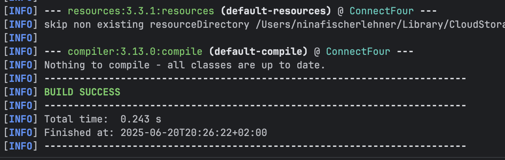
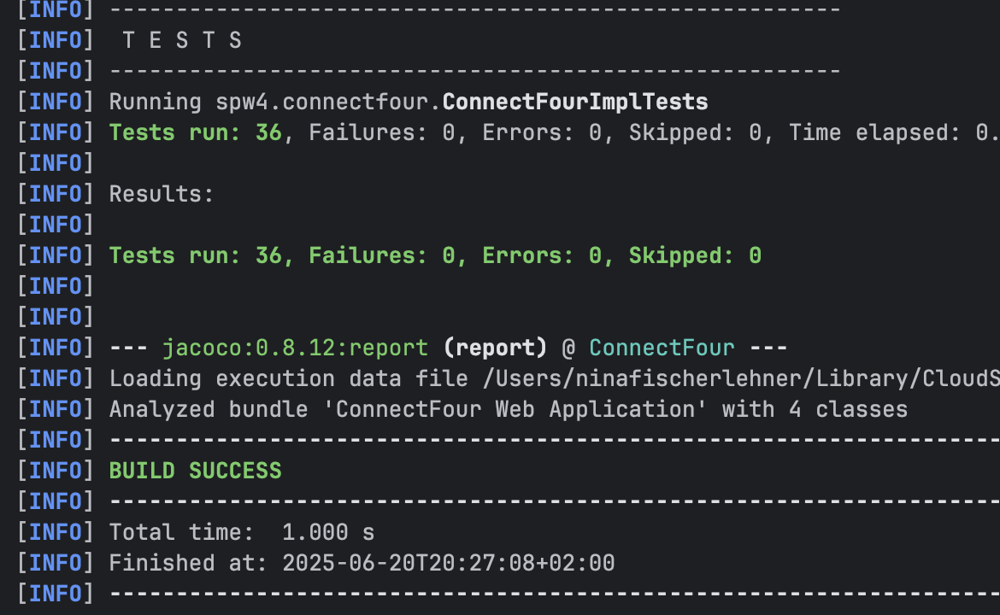
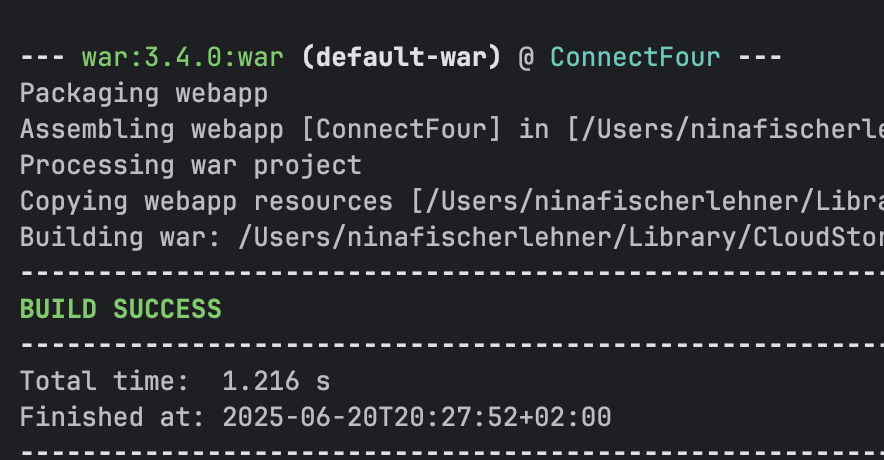
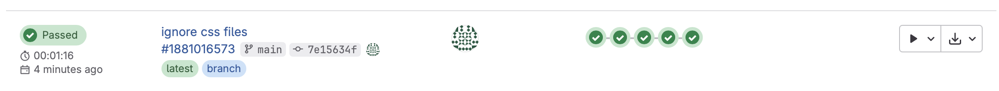
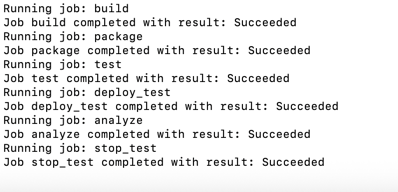
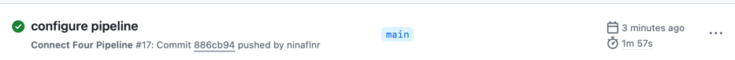
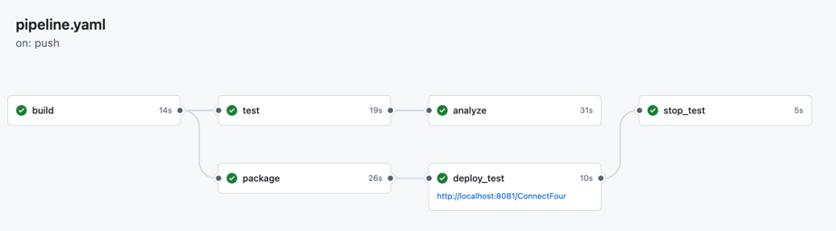

SPW4 - Exercise 3
=================

Name: Nina Fischerlehner

Effort in hours: 5.5

## 1. Connect Four Web Application and CI/CD Pipeline

### Task 1.a

Da ich bei meiner ConnectFour Implementation 1-based indexing verwendet habe, musste ich einiges von der Implementierung und den Tests umschreiben, da die webapp 0-based erwartet hat. Danach gingen die Tests aber problemlos durch:

mvn compile:

mvn test:

mvn package:

Server:

### Task 1.b

Die Pipeline hat zuerst nicht funktioniert, weil node.js nicht beim docker-image verfügbar war. Ich hab länger versucht, dass es funktioniert, bin dann aber auf die Lösung gestoßen, die CSS-Files bei Sonar zu excluden, was dann funktioniert hat.

### Task 1.c

Für den Github runner wurden wie bei gitlab die verschiedenen Jobs erstellt (build, test, analyze, package, deploy_test und stop_test).

Jeder Job startet mit einer clean copy vom source code (uses actions/checkout@v4). Der build job lädt das target directory hoch, der test job lädt dies herunter und lässt die Tests laufen, analyze lädt target wieder herunter und lädt die reports dann hoch, der package job erstellt das war artifact und der deploy job lädt dieses dann herunter. Kein Job verwendet Dateien vom vorherigen (sondern lädt sie wenn nötig erneut herunter).

Sie laufen wie erwartet:

